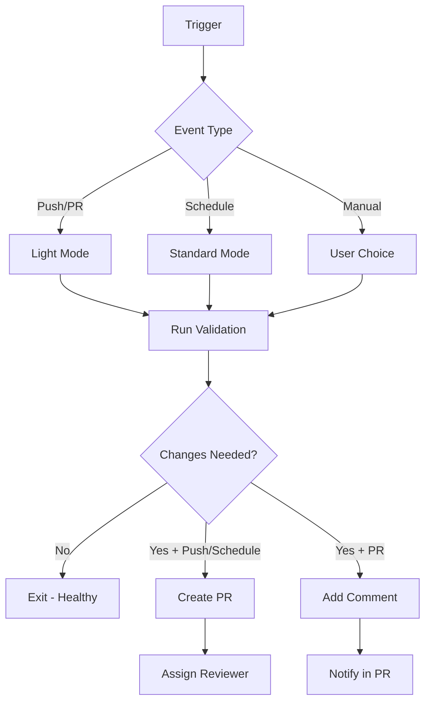

# Self-Healing Workflow Documentation

## Overview

This repository uses an automated self-healing workflow powered by Claude Code that maintains repository health, ensures agent consistency, and applies optimizations automatically.

## Features

### 🔄 Automatic Triggers
- **Push to main**: Light validation on every commit
- **Pull Requests**: Validates changes before merge
- **Manual dispatch**: Choose maintenance mode
- **Schedule**: Bi-weekly deep maintenance (optional)

### 🎯 Maintenance Modes

#### Light Mode (Default)
- **Duration**: 2-3 minutes
- **Cost**: ~$0.01
- **Tasks**:
  - Validate JSON/Markdown sync
  - Check basic syntax
  - Report critical errors
  - Exit early if healthy

#### Standard Mode
- **Duration**: 5-10 minutes
- **Cost**: ~$0.05
- **Tasks**:
  - Everything from Light mode
  - Fix sync issues
  - Validate agent schemas
  - Update metadata
  - Fix formatting

#### Deep Mode
- **Duration**: 15-20 minutes
- **Cost**: ~$0.10
- **Tasks**:
  - Everything from Standard mode
  - Analyze usage patterns
  - Suggest consolidations
  - Identify gaps
  - Generate health reports

### 🛡️ Safety Features

1. **Loop Prevention**: Skips runs on automated commits
2. **PR Safety**: Comments on PRs instead of modifying
3. **Change Validation**: Only creates PRs when needed
4. **Review Process**: Auto-assigns reviewers
5. **Clear Summaries**: Detailed job summaries

## Setup Requirements

### 1. GitHub Secrets
Add to Settings → Secrets → Actions:
- `ANTHROPIC_API_KEY`: Your Claude API key

### 2. Permissions
Repository needs:
- Actions: Read & Write
- Contents: Write
- Pull Requests: Write
- Issues: Write (for PR comments)

### 3. Branch Protection (Optional)
Protect main branch:
- Require PR reviews
- Dismiss stale reviews
- Include administrators

## Usage

### Manual Trigger
1. Go to Actions tab
2. Select "Self-Healing Repository"
3. Click "Run workflow"
4. Choose maintenance mode
5. Click "Run workflow"

### Automatic Operation
- Commits to main: Light validation
- PRs: Validation + comments
- Schedule: Standard maintenance

### Cost Optimization
- Light mode for frequent runs
- Standard for weekly maintenance
- Deep for monthly analysis
- Early exit on healthy repos

## Workflow Logic



## Troubleshooting

### Workflow Fails
1. Check API key is set correctly
2. Verify permissions are granted
3. Check Claude API status
4. Review error logs

### No Changes Detected
- Repository is healthy (good!)
- Try Deep mode for thorough check
- Manually verify agent files

### Too Many PRs
- Reduce trigger frequency
- Increase mode threshold
- Review change patterns

### High Costs
- Use Light mode more
- Reduce schedule frequency
- Check execution times

## Configuration

### Customize Modes
Edit workflow `prompt` section to adjust:
- Validation criteria
- Fix thresholds
- Analysis depth

### Change Schedule
Uncomment and modify:
```yaml
schedule:
  - cron: '0 3 * * 2,5'  # Your schedule
```

### Adjust Costs
Modify `max_turns` and `timeout_minutes`:
```yaml
max_turns: "10"  # Reduce for lower cost
timeout_minutes: "5"  # Shorter duration
```

## Best Practices

1. **Start Conservative**: Use Light mode initially
2. **Monitor Costs**: Check GitHub Action minutes
3. **Review PRs**: Don't auto-merge initially
4. **Gradual Rollout**: Test manually first
5. **Track Patterns**: Note common fixes

## Integration

### With CI/CD
```yaml
# Add to existing workflows
needs: [repo-maintenance]
if: success()
```

### With Other Checks
- Run after tests pass
- Before deployment
- As merge requirement

## Metrics

Track in GitHub Insights:
- Workflow run frequency
- Success/failure rate
- Average duration
- Changes per run

## Support

- Issues: File in this repository
- Questions: Check workflow logs
- Improvements: Submit PRs

---

*Powered by Claude Code + GitHub Actions*