<div align="center">

# 🤖 claude-code-subagents

> self-improving ai agents that actually work™

[](https://github.com/nvsio/claude-code-subagents/actions/workflows/self-healing.yml)
[](https://opensource.org/licenses/MIT)
[](http://makeapullrequest.com)
[](https://claude.ai)

</div>

## 🤔 what

a collection of specialized claude agents that get better at their jobs over time. 

think of it as hiring a team that never sleeps, never complains, and actually learns from their mistakes.

## 🚀 why

your ai assistant should level up faster than you do. 

these agents don't just execute tasks—they analyze their own performance, identify patterns, and evolve their strategies. it's like having a team that does retrospectives after every commit.

## how claude works here

### 1. agents as markdown
each agent is defined in `.claude/agents/` as a markdown file that tells claude:
- what it specializes in
- which tools it can use
- when to activate
- how to self-improve

### 2. self-healing automation
this repo uses github actions + claude api to:
- check agent configurations daily
- fix sync issues automatically
- suggest improvements based on usage
- maintain itself without human intervention

### 3. using agents in claude code
```bash
# in claude code, just mention the agent
@agent-repo-updater   # maintains agent configs
@agent-chief-product-officer   # reviews ui/ux
```

## ⚡ quickstart

```bash
# clone the collection
git clone https://github.com/nvsio/claude-code-subagents

# add agents to your project
cp -r .claude /your/project/

# that's it. agents are now available via @ mentions
```

### try it out
```bash
# in claude code:
> @agent-repo-updater check my agent configs
> @agent-chief-product-officer review this UI component
```

## 🎭 current roster

### `@agent-repo-updater` 
*the meticulous librarian*
- keeps all agents in sync between markdown and json
- suggests optimizations based on usage patterns
- self-improves by analyzing git history

### `@agent-chief-product-officer`
*the design perfectionist*
- reviews ui/ux for consistency and accessibility
- catches wcag violations before your users do
- ensures your error messages don't suck

## 🔄 self-healing magic

this repo literally maintains itself:

```mermaid
graph LR
    A[push code] --> B[github action triggers]
    B --> C[claude checks health]
    C --> D{issues found?}
    D -->|yes| E[auto-fix & commit]
    D -->|no| F[vibes ✨]
```



### enable it in your repo
```bash
# 1. add secret
gh secret set ANTHROPIC_API_KEY

# 2. copy workflow
cp .github/workflows/self-healing.yml /your/repo/

# 3. that's it. your repo now self-heals.
```

## philosophy

- agents should be excellent at one thing
- self-improvement isn't a feature, it's table stakes
- if it's not making you faster, it's not worth it

## 🤝 contribute

drop a PR. doesn't have to be perfect—claude will review it automatically and help polish it.

### what happens when you PR

1. **instant review**: claude reviews your changes within ~30 seconds
2. **constructive feedback**: get specific suggestions, not just "lgtm"
3. **automatic validation**: repo-updater checks your agent configs
4. **helpful labels**: auto-tagged based on what you changed

no gatekeeping. we want your ideas.

### ideas we'd love to see

```yaml
test-runner:
  pitch: "runs only tests affected by your changes"
  vibe: "the pragmatic qa engineer"

doc-writer:
  pitch: "generates docs that devs actually want to read"  
  vibe: "the technical writer who gets it"

perf-optimizer:
  pitch: "finds bottlenecks you didn't know existed"
  vibe: "the speed demon"

security-scanner:
  pitch: "catches vulnerabilities before the hackers do"
  vibe: "the paranoid friend you need"
```

### how to add an agent

**option 1: request an agent** (easiest)
1. ⭐ star this repo (required)
2. [create an issue](https://github.com/nvsio/claude-code-subagents/issues/new?template=new-agent-request.yml) with your idea
3. claude generates a world-class agent for you
4. review and merge the PR

**option 2: build your own**
1. create `.claude/agents/your-agent.md`
2. define its personality and capabilities
3. submit PR
4. watch repo-updater validate & improve it

rough edges welcome. perfect is the enemy of shipped.

---

*built for developers who ship*
